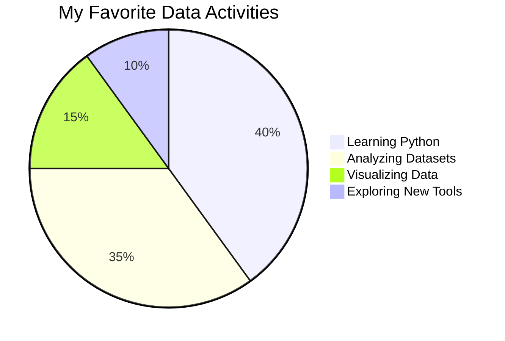

<h1 align="center">Hi, I'm Reza Shariatmadar! 👋</h1>

  
  
  

  

 

 

<!-- Activity Graph: Tokyo Night theme -->

---

## 🚀 About Me

- 🧑‍💻 **Junior Data Analyzer** — just getting started!
- 🐍 Learning Python for data analysis & visualization.
- 📊 Passionate about exploring and visualizing data.
- 🌱 Always eager to learn and share.

---

## 🛠️ Tech Stack

- Python: pandas, matplotlib, seaborn
- Data cleaning, exploration, and visualization basics
- Beginner in machine learning concepts

---

## 📘 Featured Projects

  
<h2>📊 Data Projects</h2>

  

    
    
    
  

---

## 📈 My Data Mood Graph

---

## 📬 Connect With Me

- [LinkedIn](https://www.linkedin.com/in/reza-shariatmadar)
- Always happy to meet fellow learners and data lovers!

---

> **“I have no idea how I got here”**

 

